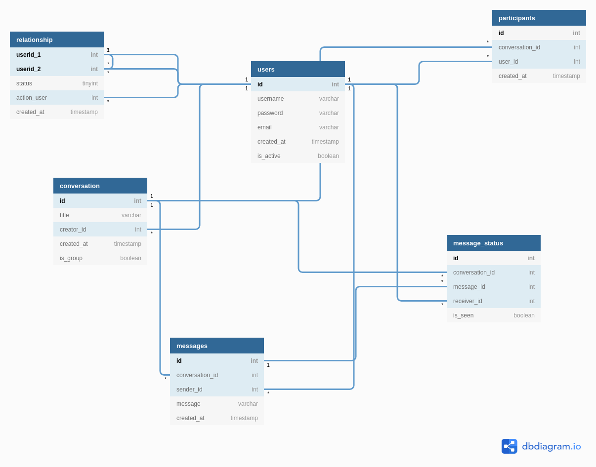

- [1. Lý thuyết](#1-lý-thuyết)
    - [1.1. Tìm hiểu các khái niệm về database](#11-tìm-hiểu-các-khái-niệm-về-database)
    - [1.2. Tìm hiểu SQL (Structure Query Language)](#12-tìm-hiểu-sql-structure-query-language)
        - [1.2.1. SQL: One of the Most Valuable Skills](#121-sql-one-of-the-most-valuable-skills)
        - [1.2.2. NoSQL Data Modeling Techniques](#122-nosql-data-modeling-techniques)
            - [1.2.2.1. Một số lưu ý về NoSQL Data Modeling](#1221-một-số-lưu-ý-về-nosql-data-modeling)
            - [1.2.2.2. Conceptual Techniques](#1222-conceptual-techniques)
                - [1.2.2.2.1. (1) Denormalization](#12221-1-denormalization)
                - [1.2.2.2.2. (2) Aggregates](#12222-2-aggregates)
                - [1.2.2.2.3. (3) Application Side Joins](#12223-3-application-side-joins)
            - [1.2.2.3. General Modeling Techniques](#1223-general-modeling-techniques)
                - [1.2.2.3.1. (4) Atomic Aggregates](#12231-4-atomic-aggregates)
                - [1.2.2.3.2. (5) Enumerable Keys](#12232-5-enumerable-keys)
                - [1.2.2.3.3. (6) Dimensionality Reduction](#12233-6-dimensionality-reduction)
                - [1.2.2.3.4. (7) Index Table](#12234-7-index-table)
                - [1.2.2.3.5. (8) Composite Key Index](#12235-8-composite-key-index)
                - [1.2.2.3.6. (9) Aggregation with Composite Keys](#12236-9-aggregation-with-composite-keys)
                - [1.2.2.3.7. (10) Inverted Search – Direct Aggregation](#12237-10-inverted-search--direct-aggregation)
            - [1.2.2.4. Hierarchy Modeling Techniques](#1224-hierarchy-modeling-techniques)
                - [1.2.2.4.1. (11) Tree Aggregation](#12241-11-tree-aggregation)
                - [1.2.2.4.2. (12) Adjacency Lists](#12242-12-adjacency-lists)
                - [1.2.2.4.3. (13) Materialized Paths](#12243-13-materialized-paths)
                - [1.2.2.4.4. (14) Nested Sets](#12244-14-nested-sets)
                - [1.2.2.4.5. (15) Nested Documents Flattening: Numbered Field Names](#12245-15-nested-documents-flattening-numbered-field-names)
                - [1.2.2.4.6. (16) Nested Documents Flattening: Proximity Queries](#12246-16-nested-documents-flattening-proximity-queries)
                - [1.2.2.4.7. (17) Batch Graph Processing](#12247-17-batch-graph-processing)
        - [1.2.3. Data Modeling Guidelines for NoSQL JSON Document Databases](#123-data-modeling-guidelines-for-nosql-json-document-databases)
            - [1.2.3.1. Why NoSQL?](#1231-why-nosql)
            - [1.2.3.2. Relational vs. NoSQL Data Modeling](#1232-relational-vs-nosql-data-modeling)
            - [1.2.3.3. Ví dụ: Design social application với Entity Ralationship modeling](#1233-ví-dụ-design-social-application-với-entity-ralationship-modeling)
                - [1.2.3.3.1. Logical Model Example](#12331-logical-model-example)
                - [1.2.3.3.2. Relational Model Example](#12332-relational-model-example)
            - [1.2.3.4. Normalization vs. Denormalization](#1234-normalization-vs-denormalization)
            - [1.2.3.5. Parent-Child Relationship–Embedded Entity](#1235-parent-child-relationshipembedded-entity)
            - [1.2.3.6. Document Model Example](#1236-document-model-example)
            - [1.2.3.7. Composite Row key design](#1237-composite-row-key-design)
            - [1.2.3.8. Generic Data, Event Data, and Entity-Attribute-Value](#1238-generic-data-event-data-and-entity-attribute-value)
            - [1.2.3.9. Tree, Adjacency List, Graph Data](#1239-tree-adjacency-list-graph-data)
            - [1.2.3.10. Inheritance Mapping](#12310-inheritance-mapping)
        - [1.2.4. Lệnh SQL](#124-lệnh-sql)
    - [1.3. MySQL](#13-mysql)
    - [1.4. Redis](#14-redis)
    - [1.5. Troubleshooting](#15-troubleshooting)
        - [1.5.1. SQL Tuning or SQL Optimization](#151-sql-tuning-or-sql-optimization)
        - [1.5.2. Query Optimization](#152-query-optimization)
    - [1.6. Design](#16-design)
        - [1.6.1. Database Design](#161-database-design)
        - [1.6.2. What is Normalization? 1NF, 2NF, 3NF & BCNF with Examples](#162-what-is-normalization-1nf-2nf-3nf--bcnf-with-examples)
- [2. Bài tập](#2-bài-tập)
- [3. Tài liệu tham khảo](#3-tài-liệu-tham-khảo)

------------------------------------------------------------


----------------
# 1. Lý thuyết

## 1.1. Tìm hiểu các khái niệm về database

- **Cơ sở dữ liệu** (Database) là một tập hợp các dữ liệu có tổ chức, thường được lưu trữ và truy cập từ hệ thống máy tính. Khi cơ sở dữ liệu trở nên phức tạp, chúng thường được phát triển bằng cách sử dụng các kỹ thuật thiết kế và mô hình hóa.

- **Hệ quản lý cơ sở dữ liệu** (Database Management System - DBMS) là phần mềm tương tác với người dùng cuối, các ứng dụng và chính cơ sở dữ liệu đó để thu thập và phân tích dữ liệu.

- **Các thuật ngữ và tổng quan**:

    - Thông thường, một database chỉ đến một tập hợp các dữ liệu liên quan và cách chúng được tổ chức. Truy cập dữ liệu đó được hỗ trợ bởi database management system (DBMS) và tập hợp các phần mềm cho phép users có thể tương tác với một hoặc nhiều databases và cung cấp một cơ chế để truy cập đến tất cả các bản ghi của database (mặc dù các ràng buộc có thể giới hạn việc truy cập đó). DBMS cung cấp một tập hợp các hàm và cho phép truy cập lưu trữ và retrieval một lượng lớn các thông tin và cung cấp các cách để quản lý việc tổ chức các thông tin đó.

    - Bởi vì các mối ràng buộc chặt chẽ giữa chúng, khái niệm "database" thường được sử dụng để chỉ đến cả database và DBMS được sử dụng quản lý nó.

    - Bên ngoài thế giới công nghệ thông tin hiện đại, khái niệm database thì thường được dùng để chỉ một tập hợp các bảng ghi, ngoài ra kích thước và vùng nhớ lưu trữ chỉ được quan tâm khi nhắc đến DBMS.

    - Các DBMSs hiện nay cung cấp một tập hợp các hàm cho phép quản lý database và được phân chia thành các loại sau.

        - **Data definition** – Khởi tạo, sửa đổi và xóa các định nghĩa của cấu trúc lưu trữ dữ liệu.
        - **Update** - Chèn, chỉnh sửa và xóa dữ liệu.
        - **Retrieval** - Cung cấp thông tin theo một khuôn mẫu để chuyển tiếp cho các yêu cầu xử lý dữ liệu bởi một ứng dụng khác. Dữ liệu được duyệt có thể sẵn sàng theo một khuôn mẫu cơ bản như là cách nó được định nghĩa trong database hoặc là một khuôn mẫu khác thay thế bởi việc kết hợp các dữ liệu có sẵn trong database đó.
        - **Administration** - Đăng kí và giám sát users, hỗ trợ cho việc bảo mật dữ liệu, quản lý hiệu suất, quản lý ràng buộc dữ liệu, xử lý điều khiển đồng thời, và phục hồi thông tin khi nó bị corrupted đột ngột do một số sự kiện tác động vào ví dụ như lỗi hệ thống.

    - Ở mức vật lý, database servers được dùng để lưu trữ một database thực sự và chạy chỉ trên DBMS và các software liên quan. Database servers thường dùng máy tính đa tiến trình, với một lượng bộ nhớ lớn với cơ chế RAID cho dữ liệu bền vững. RAID được dùng để phục hồi dữ liệu nếu bất cứ đĩa cứng nào bị hỏng. Phần cứng tăng tốc database sẽ kết nối tới một hoặc nhiều server thông qua kênh truyền tốc độ cao và cũng sử dụng một lượng lớn bộ nhớ cho việc xây dựng môi trường xử lý các tiến trình. DBMSs được hiểu như là quả tim của hầu hết các hệ cơ sở dữ liệu. Chúng được xây dựng xung quanh cơ chế đa tiến trình và kết nối với mạng của hệ điều hành.

    - Từ khi DBMSs có ý nghĩa quan trọng trên thị trường, máy tính và bộ nhớ cũng được phát triển để phù hợp với chúng.

    - Databases và DBMSs có thể được phân loại theo database model(s) mà nó hỗ trợ (như CSDL quan hệ hay XML), phân theo loại máy tính chạy nó (trên Server hay Điện thoại), theo ngôn ngữ truy vấn như SQL hay XQuery và những đặc tính ngoài kĩ thuật như hiệu năng, tính mở rộng, độ tin cậy và bảo mật.

## 1.2. Tìm hiểu SQL (Structure Query Language)

- **Ngôn ngữ truy vấn** (Query languages) là tên gọi chung để chỉ các ngôn ngữ máy tính được dùng để tạo các truy vấn trong các cơ sở dữ liệu và các hệ thống thông tin.

### 1.2.1. SQL: One of the Most Valuable Skills

- [SQL Tutorial](https://www.w3schools.com/sql/default.asp)


- **SQL a tool you can use everywhere**

- **SQL is permanent**

- **SQL: Seem better than you are**

### 1.2.2. NoSQL Data Modeling Techniques

- SQL và relational model được thiết kế để tương tác với end user:

    - End user thường quan tâm tới thông tin báo cáo tổng hợp chứ không phải là các data items riêng biệt

    - User không thể kiểm soát concurrency, integrity, consistency, or data type validity. Vì vậy, SQL chú ý tới đảm bảo các transactions, schemas và referential integrity.

- Bởi vì sự chặt chẽ này, ảnh hưởng đến hiệu suất và khả năng mở rộng. Một vài mô hình dữ liệu mới được phát triển:

    - **Key-Value storage**: đơn giản, mạnh mẽ, khả năng áp dụng kém với các trường hợp yêu cầu việc xử lý key range.

    - **Ordered Key-Value model**: khắc phục hạn chế trên và cải thiện aggregation capabilities

    - Ordered Key-Value model thì hiệu quả, nhưng nó không cung cấp framwork cho value modeling. **BigTable-style databases** mô hình hóa value dưới dạng map-of-maps-of-maps, namely, column families, columns, and timestamped versions.

    - **Document databases**

    - **Full Text Search Engines**

    - **Graph data models**


#### 1.2.2.1. Một số lưu ý về NoSQL Data Modeling

- Relational modeling: **“What answers do I have?”**. NoSQL data modeling: **“What questions do I have?”**.

- NoSQL data modeling thường đòi hỏi sự hiểu biết sâu sắc hơn về cấu trúc dữ liệu và thuật toán so với relational database modeling.

- Data duplication and denormalization

- Relational databases không tiện cho việc xử lý và mô hình hóa dữ liệu như phân cấp, biểu đồ

- Các hệ thống dùng NoSQL:

    - Key-Value Stores: Oracle Coherence, Redis, Kyoto Cabinet
    - BigTable-style Databases: Apache HBase, Apache Cassandra
    - Document Databases: MongoDB, CouchDB
    - Full Text Search Engines: Apache Lucene, Apache Solr
    - Graph Databases: neo4j, FlockDB

#### 1.2.2.2. Conceptual Techniques

##### 1.2.2.2.1. (1) Denormalization

**Denormalization**: có thể được định nghĩa là sự trùng lặp của cùng một data ở nhiều documents hoặc tables để đơn giản hóa/tối ưu hóa xử lý truy vấn hoặc để phù hợp với dữ liệu của người dùng thành một mô hình dữ liệu cụ thể.

**Ví dụ**:

Normalization: Để biết senderuser ta phải join 2 bảng


Denormalization: Để senderuser như một field của bảng Comment


**Nhận xét**: Denormalization tăng tốc các câu lệnh SELECT và giảm việc JOIN khi không cần thiết nhưng có thể bị douple dữ liệu.

- Query data volume or IO per query VS total data volume. Dùng denormalization có thể group all data cần thiết để xử lý truy vấn ở một chỗ.

- Processing complexity VS total data volume. Đơn giản hóa việc truy vấn.

**Applicability**: Key-Value Stores, Document Databases, BigTable-style Databases

##### 1.2.2.2.2. (2) Aggregates

- Soft schema cho phép tạo classes của entities với cấu trúc bên trong phức tạp (các entities lồng nhau) và thay đổi cấu trúc của các entities cụ thể. 

- Giảm quan hệ one-to-many bằng việc lồng các entities với nhau, giảm các liên kết.

**Ví dụ**:


Ban đầu, Product được mô tả gồm ID, Price và Description. Sau đó, phát triển ra nhiều Product với các thuộc tính khác nhau như Book, Album, Jeans. Hơn nữa, Album còn có quan hệ với Tracks. Soft schema cho phép dùng single Aggregate (product) để có thể modeling tất cả loại Product và các thuộc tính của chúng.

**Nhận xét**: Việc dùng Aggregates cùng với Denormalization có thể ảnh hưởng đến việc **update** cả về performance và consistency

**Applicability:** Key-Value Stores, Document Databases, BigTable-style Databases

##### 1.2.2.2.3. (3) Application Side Joins

- Joins hiếm khi được dùng trong NoSQL

- Ở NoSQL, joins thường được xử lý lúc thiết kế; còn ở relational models thì joins được xử lý lúc thực thi truy vấn.

- Joins thì ảnh hưởng performance, có thể tránh bằng Denormalization và Aggregates (ví dụ: embedding nested entities). 

- Trong nhiều trường hợp, joins là **không thể tránh**:

    - Quan hệ many-to-many

    - Aggregates không thể áp dụng với các entities thường xuyên chỉnh sửa

**Ví dụ**:


Một messages system có thể được mô hình như một User chứa các Message lồng nhau. Nhưng nếu các messages thường xuyên được thêm vào, tốt hơn nên để các Message như các entities độc lập và join chúng tới User khi truy vấn.

**Applicability***: Key-Value Stores, Document Databases, BigTable-style Databases, Graph Databases

#### 1.2.2.3. General Modeling Techniques

##### 1.2.2.3.1. (4) Atomic Aggregates

- NoSQL hỗ trợ transaction còn hạn chế. Trong một số trường hợp, có thể áp dụng transaction bằng cách sử dụng **distributed locks** hoặc **application-managed MVCC** nhưng thông thường vẫn là model data bằng cách sử dụng **Aggregates** để đảm bảo một số tính chất của ACID.

- Transaction là một phần tất yếu cả relational databases vì normalized data yêu cầu update data nhiều chỗ. Mặt khác, Aggregates cho phép lưu trữ **single business entity** như một document, row hoặc key-value pair và **update it atomically**.

**Ví dụ**:


- Dĩ nhiên, Atomic Aggregates không phải là một giải pháp transaction hoàn hảo

**Applicability**: Key-Value Stores, Document Databases, BigTable-style Databases

##### 1.2.2.3.2. (5) Enumerable Keys

Lợi ích lớn nhất của unordered Key-Value data model là các entries có thể được phân vùng trên nhiều servers chỉ bằng cách hash key. Sắp xếp sẽ phức tạp hơn, nhưng đôi khi một ứng dụng có thể tận dụng lợi ích của việc ordered keys ngay cả khi storage không hỗ trợ tính năng này.

**Ví dụ**:

1. Một số NoSQL stores cung cấp atomic counters cho phéo tạo IDs tuần tự. Trong trường hợp này, có thể lưu messages bằng *userID_messageID* làm **composite key** (khóa tổng hợp). Nếu biết message ID gần nhất, có thể duyệt được các messages trước đó, cũng có thể duyệt được các messages kế.

2. Messages có thể được group lại thành các buckets như daily buckets. Nó cho phé ta duyệt một mail box lùi hoặc tiến bắt đầu tiwf bất kỳ ngày nào được chỉ định hoặc ngày hiện tại.

**Applicability**: Key-Value Stores

##### 1.2.2.3.3. (6) Dimensionality Reduction

Dimensionality Reduction: cho phép ánh xạ multidimensional data (dữ liệu đa chiều) tới Key-Value model hoặc tới non-multidimensional models khác.

**Ví dụ**: Geohash dùng Z-like scan để lấp đầy không gian 2D và mỗi lần di chuyển được encode là 0 hoặc 1 tùy theo hướng. Các bits cho di chuyển theo kinh độ và vĩ độ. Màu đen và màu đỏ tương ứng với kinh độ và vĩ độ:


**Applicability**: Key-Value Stores, Document Databases, BigTable-style Databases

##### 1.2.2.3.4. (7) Index Table

Ý tưởng là tạo và duy trì một bảng đặc biệt với các khóa theo mẫu truy cập.

**Ví dụ**: Một master table lưu user accounts được truy xuất bằng user ID. Một truy vấn truy xuất được all users trong một thành phố được chỉ định bằng cách thêm vào một bảng như sau:


Index table có thể được update khi master table update. Dẫn tới ảnh hưởng performance và là một consistency issue.

Index table có thể được coi như một dạng của materialized views trong ralational databases.

**Applicability**: BigTable-style Databases

##### 1.2.2.3.5. (8) Composite Key Index

Composite key: cực kỳ hữu ích khi một lưu trữ với ordered keys được dùng.

**Ví dụ**: 


**Applicability**: BigTable-style Databases

##### 1.2.2.3.6. (9) Aggregation with Composite Keys

Composite keys không chỉ cho việc đánh index mà còn cho việc griup.

**Ví dụ**: Có một mảng các log records chứa thông tin về internet users và các sites mà họ click. Đếm số unique users cho mỗi site. Tương tự như SQL Query sau:


Ý tưởng là giữ lại all records cho một user rồi sắp xếp lại, do đó có thể fetch một frame vào memory (một user không thể tạo quá nhiều events) và loại bỏ các site duplicates (chẳng hạn như hash table). Cách tiếp cận khác là có một entry cho mỗi user và append sites vào entry này khi có event đến. Tuy nhiên, sửa entry thì kém hiệu quả hơn insert entry.

**Applicability**: Ordered Key-Value Stores, BigTable-style Databases

##### 1.2.2.3.7. (10) Inverted Search – Direct Aggregation

Kỹ thuật này là một data processing pettern hơn là một data modeling. Tuy nhiên, data models cũng chịu ảnh hưởng bởi pattern này.

Ý tưởng chính là sử dụng một index để tìm data mà đáp ứng tiêu chí nào đó, nhưng aggregate data bằng original representation hoặc full scans.

**Ví dụ**: Có các log recoreds ghi thông tin về internet users và các sites mà họ click. Giả sử, mỗi record gồm user ID, categories (Men, Women, Bloggers,...), city và visited site. Mục tiêu là đưa ra các đối tượng đáp ứng vài tiêu chí (site, city,...) về các unique users cho mỗi category xuất hiện trong nhóm đối tượng.

Rõ ràng, để tìm các users mà đáp ứng tiêu chí có thể được thực hiện hiệu quả bằng việc dùng inverted indexes (chỉ mục đảo ngược) như: {Category -> user IDs} hoặc {Site -> user IDs}. 

Inverted index tương tự như SQL Query sau: `SELECT count(distinct(user_id)) ... GROUP BY category`

Inverted index sẽ xử lý không hiệu quả nếu số lượng các categories lớn. Để đối phó điều này, ta có thể xây dựng một direct index có dạng {UserID -> [Categories]} và lặp nó để xây dựng final report:


Có thể một số tập users có thể được tính toán trước cho các tiêu chí khác nhau và sau đó all reports được tính lại trong full scan of direct hoặc inverse index.

**Applicability**: Key-Value Stores, BigTable-style Databases, Document Databases

#### 1.2.2.4. Hierarchy Modeling Techniques

##### 1.2.2.4.1. (11) Tree Aggregation

Tree hoặc các graphs tùy ý (với sự hỗ trợ của denormalization) có thể được model như một single recored hoặc document.

- Kỹ thuật này hiệu quả khi tree được truy cập cùng một lúc (như: toàn bộ tree của blog comments được fetch để hiển thị một page với một bài post)

- Tìm kiếm và truy cập tùy ý vào các entries có thể có vấn đề

- Update thì không hiệu quả

**Ví dụ**:


**Applicability**: Key-Value Stores, Document Databases

##### 1.2.2.4.2. (12) Adjacency Lists

Adjacency Lists là một cách đơn giản để graph modeling - mỗi node được modeled như một record độc lập gồm mảng các ancestors (tổ tiên) và descendants (hậu duệ). 

**Ví dụ**:


**Applicability**: Key-Value Stores, Document Databases

##### 1.2.2.4.3. (13) Materialized Paths

Materialized Paths: là một kỹ thuật giúp **tránh recursive traversal** (duyệt đệ quy) trong cấu trúc như tree. Có thể coi là một dạng denormalization.

Ý tưởng là thuộc tính của mỗi node sẽ định danh bởi parents hoặc children của chính nó, để có thể xác định all descendants hoặc predecessors của node mà không cần traversal:


Materialized Paths có thể lưu trữ một tập các IDs hoặc dưới dạng một chuỗi ID được nối. Nó cho phép tìm các nodes thỏa tiêu chí nào đó bằng regular expressions:


**Applicability**: Key-Value Stores, Document Databases, Search Engines

##### 1.2.2.4.4. (14) Nested Sets

Nested sets là kỹ thuật tiêu chuẩn cho modeling tree-like structures. Nó được sử dụng rộng rãi trong ralational databases, nhưng nó hoàn toàn có thể áp dụng cho Key-Value stores và Document Databases.

Ý tưởng là lưu trữ các leafs của tree trong một mảng và map (ánh xạ) non-leaf node tới một range of leafs bằng cách dùng start và end indexes:


Cấu trúc này thì khá hiệu quả đối với data không đổi bởi vì nó có dung lượng bộ nhớ nhỏ và cho phép fatch all leafs cho một node nhất định mà không cần traversals. Tuy nhiên, insert và update thì khá tốn kém vì sẽ gây ra việc update các indexes.

**Applicability**: Key-Value Stores, Document Databases

##### 1.2.2.4.5. (15) Nested Documents Flattening: Numbered Field Names

Search Engines thường làm việc với các flat document (ví dụ: mỗi document là một flat list của fields và values). Mục tiêu của data modeling là map các business entities tới plain documents và điều này sẽ là một thách thức nếu cấu trúc entities phức tạp.

**Ví dụ**: Việc mapping documents với hierarchical structure (cấu trúc phân cấp) như documents với nested documents bên trong:


Mỗi business entity như một resume (sơ yếu lý lịch). Nó chứa person's name và list các skills với skill level tương ứng. Các rõ ràng để tiếp cận là tạo một plain document với Skill và Level fields. Model này cho phép tìm một person bằng skill hoặc bằng level, nhưng truy vấn kết hợp cả 2 fields có thể dẫn đến false matjches như hình trên.

Để khắc phục vấn đề trên, ý tưởng là lập index cho mỗi skill và level tương ứng dưới dạng một cặp fields Skill_i và Level_i, và tìm kiếm đồng thời các cặp này:


Cách tiếp cận này không thực sự có khả năng mở rộng vì độ phức tạp của truy vấn cao giống như một function của số các nested structures.

**Applicability**: Search Engines

##### 1.2.2.4.6. (16) Nested Documents Flattening: Proximity Queries

Vấn đề của nested documents có thể được giải quyết bằng kỹ thuật sử dụng proximity queries (truy vấn gần) để giới hạn acceptable distance (khoảng cách chấp nhận được) giữa các words (từ) trong document.

**Ví dụ**: All skills và levels được đánh index trong một field, có name và SkillAndLevel, query chỉ ra các từ "Excellent" và "Poetry":


**Applicability**: Search Engines

##### 1.2.2.4.7. (17) Batch Graph Processing

Graph databases như neoj4 đặc biệt tốt để khám phá các vùng lân cận của một node chỉ định hoặc quan hệ giữa 2 hay vài nodes. Tuy nhiên, global processing của large graphs thì không hiệu quả lắm vì các graph databases không scale tốt.

Distributed graph processing có thể được thực hiện bằng [MapReduce và Message Passing pattern](https://highlyscalable.wordpress.com/2012/02/01/mapreduce-patterns/). Cách tiếp cận này làm cho Key-Value stores, Document databases và BigTable-style databases phù hợp để xử lý large graphs.

**Applicability**: Key-Value Stores, Document Databases, BigTable-style Databases

### 1.2.3. Data Modeling Guidelines for NoSQL JSON Document Databases

Document databases như MapR Database đôi khi được gọi là **schema-less**, nhưng đây là cách gọi sai. Document databases không yêu cầu cấu trúc xác định trước như ralational database, nhưng ta phải xác định các khía cạnh về cách mà ta định tổ chức dữ liệu của mình.

Thông thường với NoSQL data store, ta muốn aggregate (tổng hợp) data để data có thể nhanh chóng được đọc thay vì joins.

#### 1.2.3.1. Why NoSQL?


#### 1.2.3.2. Relational vs. NoSQL Data Modeling

- Trong ralational design, trọng tâm là mô tả entity và quan hệ của nó với các entities khác; các queries và indexes thiết kế sau. Với relational database, ta cần normalize schema, giúp loại bỏ data dư thừa và lưu trữ hiệu quả. Sau đó, queries với joins để mang data trở lại. Tuy nhiên, joins gây ra bottlenecks cho việc đọc, với data phân tán trên một cluster, model này không thể scale theo chiều ngang.

- Với MapR database, talbe tự động phân vùng trên một cluster theo key range và mỗi server là source cho một subset của một table (gọi là tablet). MapR database có một **query-first** schema design, queries được định danh trước, sau đó row key được design để phân tán data đồng đều và đưa primary index có ý nghĩa cho query. Row document (JSON) hoặc columns (HBase) nên được design để group data với nhau để được đọc cùng nhau. Với MapR database, ta de-normalize schema để lưu trữ một row hoặc document mà nultiple tablets với indexes trong relational world. Group data bằng key range giúp việc đọc và ghi nhanh hơn bằng key row.


#### 1.2.3.3. Ví dụ: Design social application với Entity Ralationship modeling

Bắt đầu với Entity Ralationship modeling xác định entities, ralationships và attributes:


**Ví dụ**: Dùng social application như reddit

- Users có thể post URLs tới articles bằng category (news, sports,...)


- Users có thể comments trên posts


Query requirements:

- Hiển thị các posts theo category và data (gần đây để trước)

- Hiển thị comments theo post

- Hiển thị posts theo userid

##### 1.2.3.3.1. Logical Model Example

E-R Diagram cho social application:


- Entities: User, Post, Comment, Category

- Relations:

    - User tạo bài post
    - Bài post có comments
    - Bài post thuộc về một category

##### 1.2.3.3.2. Relational Model Example

Relational model cho social application:


- User one-to-many Post

- User one-to-many Comment

- Post one-to-many Comment

- Category one-to-many Post

#### 1.2.3.4. Normalization vs. Denormalization

**Normalization**

Trong ralational database, ta normalize schema để loại bỏ dư thừa bằng cách đặt thông tin lặp lại vào một table của riêng nó.

Ví dụ: Ta có một order table, có quan hệ one-to-many với order items table. Order items table có foreign key với id của order tương ứng.


**Denormalization**

Trong denormalized datastore, ta có thể lưu trữ một table có nhiều indexes trong relational world. Denormalization có thể coi là sự thay thế của Joins. Thông thường, NoSQL, ta de-normalize hoặc duplicate data để data được truy cập và lưu trữ cùng nhau.

#### 1.2.3.5. Parent-Child Relationship–Embedded Entity

Đây là ví dụ về denormalization SALES_ITEM schema trong Document database:

```
{
    "_id": "123",
    "date": "10/10/2017",
    “ship_status”:”backordered”
    "orderitems": [
        {
            "itemid": "4348",
            "price": 10.00
        },
        {
            "itemid": "5648",
            "price": 15.00
        }]
}
```

Nếu các tables có quan hệ one-to-many, có thể model nó như một single document. Ví dụ, order và related line items được lưu cùng nhau và có thể đọc cùng nhau.

Maximum default row size là 32MB và optimal size là 50-100KB.

#### 1.2.3.6. Document Model Example

Document model cho social application:


Có 2 tables trong document model so với 4 tables trong relational model:

- User details được lưu trong User table

- Posted URLs được lưu trong Post table

    - Row key bao gồm category và reverse timestamp để các bài posts sẽ được group lại theo category với lần gần nhất

    - Secondary index là postedby để biết ai đã post

    - Comments được nhúng trong post table

#### 1.2.3.7. Composite Row key design

Row keys là primary index cho MapR Database. Data tự động phân tác vì nó được ghi bằng cách sắp xếp row key range.

Ta có thể include multiple data elements trong "composite" row key, điều này hữu ích trong việc grouping rows với nhau để tìm key range.

Ví dụ: Nếu ta muốn group bài posts bằng category và date, ta có thể dùng row key dạng `"“SPORTS_20131012”"` (nếu muốn gần đây nhất trước thì dùng timestamp). Nếu muốn group restaurants theo location, có thể dùng row key `"TN_NASHVL_PANCAKEPANTRY"`.


Một option khác là thêm hash prefix (tiền tố băm) vào row key để có được sự phân tán tốt và vẫn có secondary grouping.


#### 1.2.3.8. Generic Data, Event Data, and Entity-Attribute-Value

Generic data thường được biểu thị dưới dạng name:value hoặc entity-attribute:value.

Document model cho the clinical patient event data:


#### 1.2.3.9. Tree, Adjacency List, Graph Data


Document model cho tree trên:

```
{
    "_id": "USA",
    “type”:”state”,
    "children": ["TN",”FL]
    "parent": null
}
{
    "_id": "TN",
    “type”:”state”,
    "children": ["Nashville”,”Memphis”]
    "parent": "USA”
}
{
    "_id": "FL",
    “type”:”state”,
    "children": ["Miami”,”Jacksonville”]
    "parent": "USA”
}
{
    "_id": "Nashville",
    “type”:”city”,
    "children": []
    "parent": "TN”
}
```

Mỗi document là một tree node, row key là node id. Parent field lưu parent node id. Children field lưu mảng children node ids. Secondary index trên parent và children fields cho phép tìm nhanh parent hoặc children nodes.

#### 1.2.3.10. Inheritance Mapping

Trong modern object-oriented programming models, các object types khác nhau
 có thể kế thừa từ một base type. Trong object-oriented design, các objects này coi như các thể hiện của cùng một base type, cũng như các instances của subtype tương ứng. Sẽ rất hữu ích khi lưu trữ các objects trong một single database table để đơn giản hóa các so sánh và tính toán trên nhiều objects. Nhưng chúng ta cũng cần cho phép objects của mỗi subtype lưu trữ các thuộc tính tương ứng của chúng, không áp dụng cho base type và các subtype khác. Điều này không phù hợp với relational model nhưng rất dễ với document model.


Trong ví dụ về online store, loại product là một prefix trong row key. Một số cặp key-value thì khác và có thể bị thiếu tùy thuộc vào loại product. Điều này cho phép mô hình hóa các loại product khác nhau trong cùng một table và tìm một group các products dễ bằng product type.


*************************************

| SQL                                                           | NOSQL                                                          |
|:--------------------------------------------------------------|:---------------------------------------------------------------|
| Relational Database Management System (RDBMS)                 | Non-relational or distributed database system.                 |
| These databases have fixed or static or predefined schema     | They have have dynamic schema                                  |
| These databases are not suited for hierarchical data storage. | These databases are best suited for hierarchical data storage. |
| These databases are best suited for complex queries           | These databases are not so good for complex queries            |
| Verticlly Scalable                                            | Horizontally scalable                                          |

### 1.2.4. Lệnh SQL

#### Các lệnh SQL có thể chia các loại sau:

- DDL (Data Definition Language)
- DML (Data Manipulation Language)
- DQL (Data Query Language)
- DCL (Data Control Language)
- Data administration commands
- Transactional control commands

**Defining Database Structures**

```sql
CREATE TABLE
ALTER TABLE
DROP TABLE
CREATE INDEX
ALTER INDEX
DROP INDEX
CREATE VIEW
DROP VIEW
```

**Manipulating Data**

```sql
INSERT
UPDATE
DELETE
```

**Selecting Data**

```sql
SELECT
```

**Data Control Language**

```sql
ALTER PASSWORD
GRANT
REVOKED
CREATE SYNONYM
```

**Data Administration Commands**

```sql
START AUDIT
STOP AUDIT
```

**Transactional Control Commands**

```sql
COMMIT : Saves database transactions
ROLLBACK : Undoes database transactions
SAVEPOINT : Creates points within groups of transactions in which to ROLLBACK
SET TRANSACTION : Places a name on a transaction
```

#### Các lệnh SQL thông dụng:

**ALTER TABLE** 

```sql
ALTER TABLE table_name 
ADD column_name datatype;
```
`ALTER TABLE` lets you add columns to a table in a database.

**AND**

```sql
SELECT column_name(s)
FROM table_name
WHERE column_1 = value_1
  AND column_2 = value_2;
```

`AND` is an operator that combines two conditions. Both conditions must be true for the row to be included in the result set.

**AS**

```sql
SELECT column_name AS 'Alias'
FROM table_name;
```

`AS` is a keyword in SQL that allows you to rename a column or table using an alias.

**AVG()**

```sql
SELECT AVG(column_name)
FROM table_name;
```

`AVG()` is an aggregate function that returns the average value for a numeric column.

**BETWEEN**

```sql
SELECT column_name(s)
FROM table_name
WHERE column_name BETWEEN value_1 AND value_2;
```

The `BETWEEN` operator is used to filter the result set within a certain range. The values can be numbers, text or dates.

**CASE**

```sql
SELECT column_name,
  CASE
    WHEN condition THEN 'Result_1'
    WHEN condition THEN 'Result_2'
    ELSE 'Result_3'
  END
FROM table_name;
```

`CASE` statements are used to create different outputs (usually in the `SELECT` statement). It is SQL's way of handling if-then logic.

**COUNT()**

```sql
SELECT COUNT(column_name)
FROM table_name;
```

`COUNT()` is a function that takes the name of a column as an argument and counts the number of rows where the column is not `NULL`.

**CREATE TABLE**

```sql
CREATE TABLE table_name (
  column_1 datatype, 
  column_2 datatype, 
  column_3 datatype
);
```

`CREATE TABLE` creates a new table in the database. It allows you to specify the name of the table and the name of each column in the table.


**DELETE**

```sql
DELETE FROM table_name
WHERE some_column = some_value;

```

`DELETE` statements are used to remove rows from a table.

**GROUP BY**

```sql
SELECT column_name, COUNT(*)
FROM table_name
GROUP BY column_name;
```

`GROUP BY` is a clause in SQL that is only used with aggregate functions. It is used in collaboration with the `SELECT` statement to arrange identical data into groups.


**HAVING**

```sql
SELECT column_name, COUNT(*)
FROM table_name
GROUP BY column_name
HAVING COUNT(*) > value;
```

`HAVING` was added to SQL because the WHERE keyword could not be used with aggregate functions.

**INNER JOIN**

```sql
SELECT column_name(s)
FROM table_1
JOIN table_2
  ON table_1.column_name = table_2.column_name;
```
An inner join will combine rows from different tables if the join condition is true.

**INSERT**

```sql
INSERT INTO table_name (column_1, column_2, column_3) 
VALUES (value_1, 'value_2', value_3);

```

`INSERT` statements are used to add a new row to a table.

**IS NULL / IS NOT NULL**

```sql
SELECT column_name(s)
FROM table_name
WHERE column_name IS NULL;
```

`IS NULL` and `IS NOT NULL` are operators used with the `WHERE` clause to test for empty values.

**LIKE**

```sql
SELECT column_name(s)
FROM table_name
WHERE column_name LIKE pattern;

```

`LIKE` is a special operator used with the `WHERE` clause to search for a specific pattern in a column.

**LIMIT**

```sql
SELECT column_name(s)
FROM table_name
LIMIT number;
```

`LIMIT` is a clause that lets you specify the maximum number of rows the result set will have.

**MAX()**

```sql
SELECT MAX(column_name)
FROM table_name;
```

`MAX()` is a function that takes the name of a column as an argument and returns the largest value in that column.

**MIN()**

```sql
SELECT MIN(column_name)
FROM table_name;
```

`MIN()` is a function that takes the name of a column as an argument and returns the smallest value in that column.

**OR**

```sql
SELECT column_name
FROM table_name
WHERE column_name = value_1
   OR column_name = value_2;
```

`OR` is an operator that filters the result set to only include rows where either condition is true.

**ORDER BY**

```sql
SELECT column_name
FROM table_name
ORDER BY column_name ASC | DESC;
```

`ORDER BY` is a clause that indicates you want to sort the result set by a particular column either alphabetically or numerically.

**OUTER JOIN**

```sql
SELECT column_name(s)
FROM table_1
LEFT JOIN table_2
  ON table_1.column_name = table_2.column_name;
```

An outer join will combine rows from different tables even if the join condition is not met. Every row in the left table is returned in the result set, and if the join condition is not met, then NULL values are used to fill in the columns from the right table.

**ROUND()**

```sql
SELECT ROUND(column_name, integer)
FROM table_name;
```
`ROUND()` is a function that takes a column name and an integer as an argument. It rounds the values in the column to the number of decimal places specified by the integer.

**SELECT**

```sql
SELECT column_name 
FROM table_name;
```

`SELECT` statements are used to fetch data from a database. Every query will begin with SELECT.

**SELECT DISTINCT**

```sql
SELECT DISTINCT column_name
FROM table_name;
```

`SELECT DISTINCT` specifies that the statement is going to be a query that returns unique values in the specified column(s).

**SUM**

```sql
SELECT SUM(column_name)
FROM table_name;
```

`SUM()` is a function that takes the name of a column as an argument and returns the sum of all the values in that column.

**UPDATE**

```sql
UPDATE table_name
SET some_column = some_value
WHERE some_column = some_value;
```
`UPDATE` statements allow you to edit rows in a table.

**WHERE**

```sql
SELECT column_name(s)
FROM table_name
WHERE column_name operator value;
```

`WHERE` is a clause that indicates you want to filter the result set to include only rows where the following condition is true.

**WITH**

```sql
WITH temporary_name AS (
   SELECT *
   FROM table_name)
SELECT *
FROM temporary_name
WHERE column_name operator value;
```

`WITH`clause lets you store the result of a query in a temporary table using an alias. You can also define multiple temporary tables using a comma and with one instance of the `WITH` keyword.

The `WITH` clause is also known as common table expression (CTE) and subquery factoring.

**************************************

## 1.3. MySQL

[MySQL README](./MySQL.md)

## 1.4. Redis

[Redis README](./Redis.md)

## 1.5. Troubleshooting

### 1.5.1. SQL Tuning or SQL Optimization

- 1) SQL query sẽ nhanh hơn nếu dùng chính xác tên columns thay vì dùng '*'.

`SELECT id, first_name, last_name, age, subject FROM student_details;` 

Thay cho:

`SELECT * FROM student_details;`

- 2) HAVING clause được dùng để lọc các rows sau khi tất cả các rows được select. Nó giống như bộ lọc. Không dùng HAVING cho mục đích khác.

```
SELECT subject, count(subject) 
FROM student_details 
WHERE subject != 'Science' 
AND subject != 'Maths' 
GROUP BY subject;
```

Thay cho:

```
SELECT subject, count(subject) 
FROM student_details 
GROUP BY subject 
HAVING subject!= 'Vancouver' AND subject!= 'Toronto';
```

- 3) Đôi khi có thể có nhiều subqueries trong main query. Cố gắng giảm thiểu số subquery trong query.

```
SELECT name 
FROM employee 
WHERE (salary, age ) = (SELECT MAX (salary), MAX (age) 
FROM employee_details) 
AND dept = 'Electronics'; 
```

Thay cho:

```
SELECT name 
FROM employee
WHERE salary = (SELECT MAX(salary) FROM employee_details) 
AND age = (SELECT MAX(age) FROM employee_details) 
AND emp_dept = 'Electronics';
```

- 4) Dùng EXISTS, IN và table joins sao cho thích hợp trong query

    - Dùng IN có performance chậm nhất

    - IN hiệu quả khi hầu hết các tiêu chí lọc nằm trong subquery

    - EXISTS hiệu quả khi hầu hết các tiêu chí lọc trong main query

```
Select * from product p 
where EXISTS (select * from order_items o 
where o.product_id = p.product_id)
```

Thay cho:

```
Select * from product p 
where product_id IN 
(select product_id from order_items
```

- 5) EXISTS thay cho DISTINCT khi sử dụng joins các tables có quan hệ one-to-many.

```
SELECT d.dept_id, d.dept 
FROM dept d 
WHERE EXISTS ( SELECT 'X' FROM employee e WHERE e.dept = d.dept);
```

Thay cho:

```
SELECT DISTINCT d.dept_id, d.dept 
FROM dept d,employee e 
WHERE e.dept = e.dept;
```

- 6) Thử dùng UNION ALL thay cho UNION

```
SELECT id, first_name 
FROM student_details_class10 
UNION ALL 
SELECT id, first_name 
FROM sports_team;
```

Thay cho:

```
SELECT id, first_name, subject 
FROM student_details_class10 
UNION 
SELECT id, first_name 
FROM sports_team;
```

- 7) Cẩn thận khi sử dụng điều kiện trong WHERE clause.

```
SELECT id, first_name, age 
FROM student_details 
WHERE first_name LIKE 'Chan%';
```

Thay cho:

```
SELECT id, first_name, age 
FROM student_details 
WHERE SUBSTR(first_name,1,3) = 'Cha';
```

- 8) Dùng DECODE để tránh việc scanning cùng rows hoặc joining cùng table lặp đi lặp lại. DECODE cũng có thể được dùng để thay cho GROUP BY hoặc ORDER BY.

```
SELECT id FROM employee 
WHERE name LIKE 'Ramesh%' 
and location = 'Bangalore';
```

Thay cho:

```
SELECT DECODE(location,'Bangalore',id,NULL) id FROM employee 
WHERE name LIKE 'Ramesh%';
```

- 9) Để lưu trữ các binary objects lớn, đầu tiên đặt chúng trong file system và add file path trong database.

- 10) Để viết các queries cho performance cao theo các quy tắc SQL chuẩn.

    - Dùng single case cho tất cả SQL verbs

    - Bắt đầu tất cả các SQL verbs bằng cách xuống dòng

    - Phân tách tất cả các từ bằng dấu khoảng trắng

    - Căn phải hoặc căn trái các verbs trong initial SQL verb

### 1.5.2. Query Optimization

[Demo Query Optimization](https://github.com/pingcap/tidb-academy-labs/blob/master/3-query-optimization.md)

**Ví dụ mở đầu**:

```
use bikeshare;
SELECT * FROM trips WHERE bike_number = 'W22041' and DATE(start_date) = '2017-12-01'\G
```

=> Mất 6.35s để thực thi. Làm sao để cải thiện hiệu suất?

**Using EXPLAIN**

Đầu tiên, chạy query thông qua EXPLAIN. Nó không thực thi query, nhưng hiển thị kế hoạch thực thi (execution plan) được chọn để thực thi:

`EXPLAIN SELECT * FROM trips WHERE bike_number = 'W22041' and DATE(start_date) = '2017-12-01';`

Ta có thể thấy được trong operator info, trips table được scan từ -inf tới +inf, tức là không có index để lọc trên bike_number = 'W22041' hoặc DATA(start_date) = '2017-12-01'.

**Evaluating index choices**

- An index on s (start_date)

- An index on b (bike_number)

- A composite index on sb (start_date, bike_number)

- A composite index on bs (bike_number, start_date)

Đánh index như thế nào là tốt nhất. Hãy xét các trường hợp trên.

**Index s**

Đánh index s, sau đó chạy EXPLAIN:

```
ALTER TABLE trips ADD INDEX s (start_date);
EXPLAIN SELECT * FROM trips WHERE bike_number = 'W22041' and DATE(start_date) = '2017-12-01';
```

Sau khi chạy EXPLAIN, execution plan không có thay đổi gì cả. Tại sao?

Thử để DATE(start_date) = '2017-12-01' trước vẫn không được:

`EXPLAIN SELECT * FROM trips WHERE DATE(start_date) = '2017-12-01' and bike_number = 'W22041';`

Lý do là vì DATE(start_date) = '2017-12-01' không thể "mở rộng". Thử đổi điều kiện lại:

`EXPLAIN SELECT * FROM trips WHERE bike_number='W22041' and start_date BETWEEN '2017-12-01 00:00:00' AND '2017-12-01 23:59:59';`

Có khoảng 3853 rows khớp với điều kiện start_date BETWEEN '2017-12-01 00:00:00' AND '2017-12-01 23:59:59'

OK. Execution plan đã thay đổi. Thử thực thi select lại. Thì thấy mất 0.06s.

**Index b**

Đánh index b, sau đó chạy EXPLAIN:

```
ALTER TABLE trips ADD INDEX b (bike_number);
EXPLAIN SELECT * FROM trips WHERE bike_number='W22041' and start_date BETWEEN '2017-12-01 00:00:00' AND '2017-12-01 23:59:59';
```

Thực thi select mất 0.03s

Có khoảng 20 rows khớp với bike_number = 'W22041', ít hơn rất nhiều so với số rows khớp ở Index s nên nhanh hơn.

**Index sb**

```
ALTER TABLE trips ADD INDEX sb (start_date, bike_number);
EXPLAIN SELECT * FROM trips WHERE bike_number='W22041' and start_date BETWEEN '2017-12-01 00:00:00' AND '2017-12-01 23:59:59';
```

Đánh index cho start_date, sau đó đánh index cho bike_number

**Index bs**

```
ALTER TABLE trips ADD INDEX bs (bike_number, start_date);
EXPLAIN SELECT * FROM trips WHERE bike_number='W22041' and start_date BETWEEN '2017-12-01 00:00:00' AND '2017-12-01 23:59:59';
```

## 1.6. Design

### 1.6.1. Database Design

**Data Models**

Bước đầu của design database là tạo ra data model chắt lọc tất cả các yêu cầu chắc năng cho ứng dụng vào data collections.

Những điều cần lưu ý và tránh:

- Business processes (quy trình nghiệp vụ) đôi khi có thể bị duplicate trong database structure, sẽ tạo ra vấn đề khi process (quy trình) thay đổi. Một data model tốt cung cấp tính độc lập linh hoạt cho bất kỳ process nào.

- Table bị duplicate không cần thiết ở nhiều chỗ trong cùng database. Đây là vấn đề lớn trong relational database.

- Data khó trình xuất hoặc chia sẻ với software applications khác. Nếu data sharing quan trọng, data model nên đảm bảo data có thể trích xuất dễ dàng.

**NoSQL Database Design**

Design cho NoSQL Database phụ thuộc vào loại database:

- Document stores: là cặp key định danh và document (có thể là document, key-value pairs hoặc key-value arrays)

- Graph stores: được thiết kế để lưu data tốt nhất được biểu thị bằng graphs (đồ thị), data được kết nối với nhau bằng một số lượng quan hệ không xác định (social networks hoặc road maps)

- Key-value stores: đơn giản nhất, mỗi bit của data lưu trữ name (key) và data (value) của nó

- Wide Column stores: được tối ưu cho truy vấn trên tập data lớn

NoSQL database data model techniques:

- Denormalization: đặt tất cả data cần thiết để có thể trả về câu truy vấn tại chung một nơi, thường là một table, thay vì chia data trên nhiều table

- Aggregates: dùng light hoặc no validation của data types, như strings hoặc integers

- Joins: được thực hiện của application level, không phải là một phần của database query. Điều này đòi hỏi nhiều kế hoạch hơn để khớp một loại hoặc một tập data với các cái khác.

- Indexs và key tables: để xác định và sắp xếp data nhanh để truy xuất

- Tree structures: có thể được mô hình hóa như một single data entity, ví dụ như một commet và tất cả các responses của nó

**Relational (SQL) Database Design**

Các bước để design relational database:

- Xác định mục đích của database

- Tìm hiểu và thu thập tất cả các thông tin về data được đưa vào database và mục đích của database theo thời gian

- Chia data được đưa vào thành các subjects hoặc các types (ví dụ như thông tin của user account). Mỗi cái trong số này nên là các table trong database

- Trên mỗi database table, cần xác định data points. Mỗi data point sẽ là một column trong database table

- Trên mỗi database table, xác định primary key sao cho hợp lý và duy nhất để định danh row của data

- So sánh và đánh giá cách data trong các tables có liên quan với nhau như thế nào. Thêm các fields hoặc có thể là các tables, để làm rõ mối quan hệ giữa data trong mỗi table

- Test database design, sau đó code queris cho các tasks phổ biến. Tinh chỉnh table design nếu cần

- Normalize database design để đảm bảo mỗi table chỉ thể hiện một thứ hoặc khái niệm với tham chiếu và quan hệ tới các tables khác nếu cần

### 1.6.2. What is Normalization? 1NF, 2NF, 3NF & BCNF with Examples

**Database development life cycle**

.png)

**1NF**

- Mỗi cell trong talbe là single value

- Không có record nào trong table trùng nhau

>Một quan hệ ở dạng chuẩn 1 không có các trường lặp và các trường kép, còn được gọi là cấu trúc phẳng (tất cả các giá trị tại các thuộc tính phải là giá trị "nguyên tố".

Ví dụ: Biến đổi phi dạng chuẩn về dạng chuẩn 1:


**Key**

Định danh record trong table. Có thể gồm 1 hoặc tích hợp nhiều column.

**Primary key**

Là một single column value. 

NOT NULL, duy nhất, hiếm thay đổi, khi insert new record phải có primary key cho record đó.

**Composite key**

Là primary key gồm nhiều columns để định danh record.


**2NF (Second Normal Form) Rules**

- Đạt dạng chuẩn 1

- Single Column Primary Key

Chia bảng dạng 1NF thành 2 bảng trên.

>Một lược đồ đạt dạng chuẩn 2 nếu như lược đồ đó đạt dạng chuẩn 1 và các thuộc tính không khóa phụ thuộc đầy đủ vào thuộc tính khóa.

Ví dụ: Biến đổi dạng chuẩn 1 thành dạng chuẩn 2:


**Foreign Key**

Foreign key tham chiếu tới Primary key của bảng khác.

- Foreign key có thể khác tên so với primary key

- Đảm bảo rows trong table này có các rows tương ứng trong table khác

- Không nhất thiết phải là duy nhất

- Có thể NULL

**3NF (Third Normal Form) Rules**

- Đạt dạng chuẩn 2

- Không phụ thuộc bắc cầu

>Một lược đồ ở dạng chuẩn 3 khi nó đạt dạng chuẩn 2 và tất cả các thuộc tính không khóa không phụ thuộc bắc cầu vào khóa.

Ví dụ: Biến đổi dạng chuẩn 2 lên dạng chuẩn 3:


**Boyce-Codd Normal Form (BCNF)**

>Một lược đồ chỉ đạt dạng chuẩn BCK nếu khi mỗi xác định (phụ thuộc) có vế trái đều là siêu khóa/khóa.

Ví dụ: Biến đổi dạng chuẩn 3 lên dạng chuẩn BCK:


# 2. Bài tập

**Yêu cầu:** Thiết kế **schema** cho chương trình chat - trò chuyện (với Redis và với MySQL), sử dụng Python để tương tác.



**Mô tả chương trình chat:** Tâm sự với người lạ

- Tạo tài khoản (username/password, email,...)
- Hiển thị trạng thái online/offline của người khác
- Chọn người trò chuyện (theo username hoặc email)
- Chat trong nhóm
- Trò chuyện (chat)
- Hiển thị lịch sử trò chuyện (nếu có)
- Hiện thị trạng thái tin nhắn (seen)

# 3. Tài liệu tham khảo

- https://vi.wikipedia.org/wiki/C%C6%A1_s%E1%BB%9F_d%E1%BB%AF_li%E1%BB%87u

- http://highscalability.com/blog/2011/2/10/database-isolation-levels-and-their-effects-on-performance-a.html

- https://en.wikipedia.org/wiki/SQL_syntax

- http://highscalability.com/blog/2011/2/10/database-isolation-levels-and-their-effects-on-performance-a.html

- https://viblo.asia/p/isolation-level-of-mysql-63vKjRmAK2R

- https://auth0.com/blog/adding-salt-to-hashing-a-better-way-to-store-passwords/

- http://www.dataorienteddesign.com/dodbook/

- https://dev.to/ben/solving-imaginary-scaling-issues-at-scale

- https://viblo.asia/p/gioi-thieu-ve-pubsub-va-su-dung-python-va-redis-demo-pubsub-V3m5WbywlO7

- https://viblo.asia/p/myisam-innodb-in-mysql-924lJOkm5PM

- https://viblo.asia/p/su-khac-nhau-giua-2-storage-engine-myisam-va-innodb-bJzKmgVPl9N

- https://viblo.asia/p/gioi-thieu-cac-storage-engine-trong-mysql-Eb85oEb8Z2G

- https://discuss.grokking.org/t/khi-nao-thi-nen-dung-table-lock-vs-row-lock/308

- https://viblo.asia/p/gioi-thieu-ve-full-text-search-BAQ3vV61vbOr

- https://support.rackspace.com/how-to/installing-mysql-server-on-ubuntu/

- https://tailieu.123host.vn/kb/hosting/huong-dan-xu-ly-loi-bang-ma-khi-import-database.html

- https://kipalog.com/posts/Mot-so-giai-phap-de-xu-ly-distributed-transaction-trong-he-thong-phan-tan

- https://dodangquan.blogspot.com/2018/07/su-dung-lock-trong-he-thong-phan-tan-voi-redis.html

- https://viblo.asia/p/phan-biet-giua-pessimistic-va-optimistic-locking-GrLZDVAg5k0

-https://github.com/yoosuf/Messenger