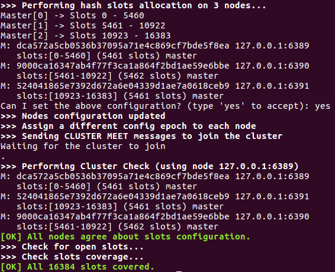
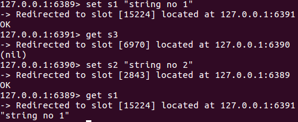
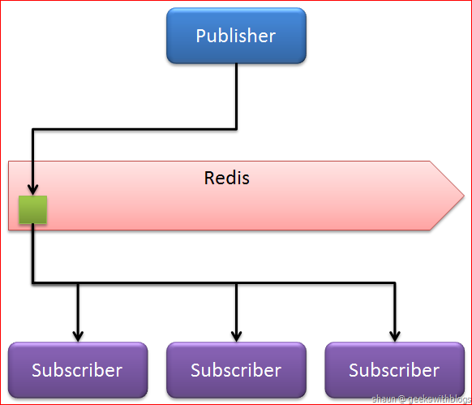
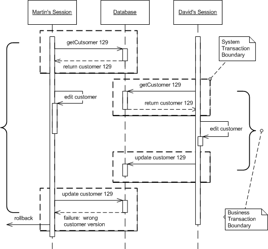
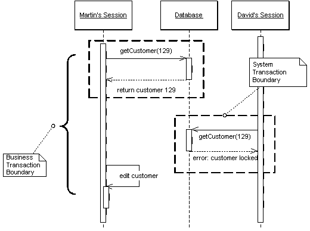

- [1.4. Redis](#14-redis)
    - [1.4.1. Version](#141-version)
    - [1.4.2. Installation](#142-installation)
    - [1.4.3. Data Types](#143-data-types)
    - [1.4.4. Pub/Sub](#144-pubsub)
    - [1.4.5. Lock](#145-lock)
        - [1.4.5.1. Pessimistic locking và Optimistic locking](#1451-pessimistic-locking-và-optimistic-locking)
            - [1.4.5.1.1. Optimistic Locking](#14511-optimistic-locking)
            - [1.4.5.1.2. Pessimistic Locking](#14512-pessimistic-locking)
            - [1.4.5.1.3. Kết luận](#14513-kết-luận)
        - [1.4.5.2. Distributed lock](#1452-distributed-lock)
        - [1.4.5.3. Thuật toán Redlock của Redis](#1453-thuật-toán-redlock-của-redis)

----------------------------------------------------------

## 1.4. Redis

### 1.4.1. Version

Tại thời điểm 10/07/2019, Redis release Stable version 5.0.5

### 1.4.2. Installation 

Cài đặt Redis:

```
wget http://download.redis.io/releases/redis-5.0.5.tar.gz
tar xzf redis-5.0.5.tar.gz
cd redis-5.0.5
make
```

Run redis server: `src/redis-server`

Run redis client: `src/redis-cli`

**Config cluster redis 3 node, chạy cùng machine, khác port**:

1. Tải và cài đặt Redis.
2. Vào thư mục chứa Redis, chạy redis-server bằng lệnh: `src/redis-server`
3. Tham khảo mô hình redis 3 node sau:


- Tuy nhiên, thay vì dùng 3 port 6379, 6380, 6381 thì ta sẽ dùng 3 port 6389. 6390. 6391 để tránh trùng port 6379 với redis-server. 
- Bạn cũng có thể dùng 3 port bất kỳ miễn là port đó chưa bị chiếm.

4. Ta sẽ tạo thư mục mô tả 3 node theo mô hình này:
- Tại thư mục cài Redis, tạo thư mục `cluster-3-node`, bên trong tạo thêm 3 thư mục tương ứng 3 node với 3 port khác nhau.

```
mkdir cluster-3-node
cd cluster-3-node
mkdir 6389 6390 6391
```

5. Tiến hành config:
- Vào thư mục `6389` tạo 2 file config a_master và c_slave tương ứng với mô hình trên để nội nội dung config.

```
cd 6389
touch a_master.conf c_slave.conf
```

- Nội dung config của a_master.conf (port 6379):

```
port 6389
cluster-enabled yes
daemonize yes
cluster-config-file nodes-6389.conf
cluster-node-timeout 5000
appendonly yes
```

- Nội dung config của c_slave.conf (vì c_slave là slave của c_master nên có port 6381):

```
port 6391
cluster-enabled yes
daemonize yes
cluster-config-file nodes-6391.conf
cluster-node-timeout 5000
appendonly yes
```

- Tương tự với 2 node còn lại.

| Server |  Master  | Slave |
| :----: | :------: | :---: |
| 1 | 6389 | 6391 |
| 2 | 6390 | 6389 |
| 3 | 6391 | 6390 |

6. Kết nối master và slave lại với nhau
- Với node 6389:

```
src/redis-server cluster-3-node/6389/a_master.conf
src/redis-server cluster-3-node/6389/c_slave.conf
```

- Tương tự với 2 node còn lại.

7. Tạo cluster

```
src/redis-cli --cluster create 127.0.0.1:6389 127.0.0.1:6390 127.0.0.1:6391
```



- Nhập yes và các master sẽ được phân cụm riêng biệt!

**Lưu ý:** Quá trình tạo cluster bị lỗi có thể tham khảo các link sau:

https://github.com/antirez/redis/issues/3154
https://stackoverflow.com/questions/37206993/redis-server-cluster-not-working

8. Thử truy cập 1 node

```
src/redis-cli -c -h 127.0.0.1 -p 6389
```



### 1.4.3. Data Types

**Strings**:

-  String là kiểu dữ liệu cơ bản nhất của Redis và đây cũng là kiểu dữ liệu duy nhất của Memcache. Có 3 câu lệnh cơ bản với String đó là GET, SET và DEL.
 
    Câu lệnh | Chức năng
    ---|---
    GET | Lấy giá trị value của key
    SET | Thiết lập giá trị cho key
    DEL | Xóa key và gía trị tương ứng (Làm việc với tất cả các kiểu dữ liệu)

    Ví dụ: 
    ```redis
    admin> SET name "thoainguyenhuynh"
    OK
    admin> GET name
    "thoainguyenhuynh"
    admin> DEL name
    (integer) 1
    admin> GET name
    (nil)    
    ```

**Hashes**:

 - Không giống như LIST và SET lưu trữ 1 tập dữ liệu là các string, HASH lưu trữ tập các map của key và value. Key vẫn là string, còn value có thể là string hoặc số. Nếu là số thì chúng ta có thể làm các thao tác tăng, giảm giá trị 1 cách đơn giản. HASH được coi là 1 mô hình thu nhỏ của Redis, khi dữ liệu được tổ chức dạng key-value. Bảng sau liệt kê các câu lệnh cơ bản khi làm việc với HASH

    Câu lệnh |	Chức năng
    ---|---
    HSET  |	Thêm 1 cặp key-value vào hash hoặc thay đổi giá trị của key đã có.
    HGET |	Lấy giá trị của key trong hash có sẵn
    HGETALL | 	Lấy ra tất cả các phần tử của hash
    HDEL |	Xóa cặp key-value ra khỏi hash (nếu key tồn tại)
    Ví dụ:
    ```
    127.0.0.1:6379> HSET ages 'long' 24
    (integer) 1
    127.0.0.1:6379> HSET ages 'nam' 23
    (integer) 1
    127.0.0.1:6379> HSET ages 'hiep' 30
    (integer) 1
    127.0.0.1:6379> HGET ages 'nam'
    "23"
    127.0.0.1:6379> HGETALL ages
    1) "long"
    2) "24"
    3) "nam"
    4) "23"
    5) "hiep"
    6) "30"
    127.0.0.1:6379> HDEL ages 'hiep'
    (integer) 1
    127.0.0.1:6379> HGETALL ages
    1) "long"
    2) "24"
    3) "nam"
    4) "23"
    ```

**Lists**:

 - List trong Redis là linked list, lưu trữ 1 danh sách có thứ tự (trước sau) của các string. Cách lưu trữ này giúp cho thời gian add thêm 1 phần tử vào đầu hoặc cuối list là hằng số, bất kể size của list là bao nhiêu. Lợi thế này cũng có 1 mặt trái là việc truy xuất đến phần tử theo index của linked list là lâu hơn rất nhiều so với array.

    Câu lệnh | Chức năng
    ---|---
    RPUSH | Cho thêm 1 giá trị vào phía bên phải của list
    LRANGE | Lấy 1 dải giá trị của list
    LINDEX | Lấy ra phần tử của list dựa theo index
    LPOP | Lấy ra giá trị ở phía ngoài cùng bên trái của list và xóa giá trị đó đi.


    Ví dụ: 
    ```redis
    27.0.0.1:6379> RPUSH students 'thoai nguyen huynh'
    (integer) 1
    27.0.0.1:6379> RPUSH students 'chi bao nguyen le'
    (integer) 2
    27.0.0.1:6379> RPUSH students 'pham hoang kha'
    (integer) 3
    (integer) 3
    27.0.0.1:6379> LRANGE students 0 1
    1) "thoai nguyen huynh"
    2) "chi bao nguyen le"
    27.0.0.1:6379> LRANGE students 0 -1
    1) "thoai nguyen huynh"
    2) "chi bao nguyen le"
    3) "pham hoang kha"
    27.0.0.1:6379> LINDEX students 1
    "chi bao nguyen le"
    27.0.0.1:6379> LPOP students
    "thoai nguyen huynh"
    27.0.0.1:6379> LRANGE students 0 -1
    1) "chi bao nguyen le"
    2) "le hoang kha"   
    ```

**Sets**:

 -  Set trong Redis khá giống với list, nhưng khác 1 điều là các phần tử trong set không được sắp xếp theo thứ tự nào cả. Tuy nhiên, Redis đã tăng performance khi làm việc với set bằng cách sử dụng 1 bảng băm (hash table) để lưu trữ các phần tử của set. Hiểu đơn giản thì mỗi item được add vào set sẽ là 1 key trong bảng băm, còn value thì không có. Việc làm này giúp theo tác truy xuất dữ liệu trên SET nhanh hơn nhiều (do tận dụng ưu thế về tốc độ tìm kiếm trên bảng băm), nhất là khi muốn đảm bảo không bị trùng lặp phần tử trong set.  

    Bốn command cơ bản khi làm việc với set là SADD, SMEMBERS, SISMEMBER, SREM


    Câu lệnh |	Chức năng
    ---|---
    SADD | Add thêm 1 phần tử vào set
    SMEMBERS | Lấy ra tất cả các phần tử của set
    SISMEMBER | Check xem 1 phần tử có tồn tại trong set hay không
    SREM | Xóa đi 1 phần tử của set (nếu nó tồn tại)

    Ví dụ :
    ```redis
    127.0.0.1:6341> SADD students 'Dinh Hoang Long'
    (integer) 1
    127.0.0.1:6341> SADD students 'Nguyen Hoai Nam'
    (integer) 1
    127.0.0.1:6341> SADD students 'Le Van Hiep'
    (integer) 1
    127.0.0.1:6341> SMEMBERS students
    1) "Nguyen Hoai Nam"
    2) "Dinh Hoang Long"
    3) "Le Van Hiep"
    127.0.0.1:6341> SISMEMBER students 'Dinh Hoang Long'
    (integer) 1
    127.0.0.1:6379> SISMEMBER students 'Nam'
    (integer) 0
    27.0.0.1:6379> SREM students 'Dinh Hoang Long'
    (integer) 1
    27.0.0.1:6379> SMEMBERS students
    1) "Nguyen Hoai Nam"
    2) "Le Van Hiep"
    ```

**Sorted Sets**:

  - Sorted Set (ZSET) là 1 phiên bản đầy đủ của set, khi mà phần value của item được thiết lập, và bắt buộc là 1 số (float number) được gọi là score. Ở điểm này thì zset khá giống với hash khi lưu trữ 1 cặp key, value (trong zset gọi là member và score). Và vì là “sorted”, nên các cặp member-score được add vào sorted set sẽ được sắp xếp theo thứ tự của các score, nếu score trùng nhau thì tiếp tục sắp xếp theo member. Ngoài ra cũng cần chú ý là không cho phép 2 phần tử khác nhau của zset có member trùng nhau. Sau đây là 4 câu lệnh cơ bản với zset.

    Câu lệnh | Chức năng
    ---|---
    ZADD |	Thêm 1 phần tử vào tập hợp với score của nó.
    ZRANGE	| Lấy ra các phần tử của tập hợp theo vị trí của chúng trong zset
    ZRANGEBYSCORE | Lấy ra các phần tử của tập hợp theo phạm vi của score
    ZREM |	Xóa 1 phần tử khỏi tập hợp (nếu nó tồn tại)
    Ví dụ:
    ````
    127.0.0.1:6379> ZADD scores 100 long
    (integer) 1
    127.0.0.1:6379> ZADD scores 80 nam
    (integer) 1
    127.0.0.1:6379> ZADD scores 90 hiep
    (integer) 1
    127.0.0.1:6379> ZRANGE scores 0 -1 WITHSCORES
    1) "nam"
    2) "80"
    3) "hiep"
    4) "90"
    5) "long"
    6) "100"
    127.0.0.1:6379> ZRANGEBYSCORE scores 89 100 WITHSCORES
    1) "hiep"
    2) "90"
    3) "long"
    4) "100"
    127.0.0.1:6379> ZREM scores hiep
    (integer) 1
    127.0.0.1:6379> ZRANGE scores 0 -1 WITHSCORES
    1) "nam"
    2) "80"
    3) "long"
    4) "100"
    ````

**Bitmaps**:

- Bitmaps không phải là dạng dữ liệu thực tế, nhưng nó là tập hợp các bit định hướng hoạt động dựa trên kiểu String. Vì String là những blobs nhị phân có độ dài tối đa là 512MB nên phù hợp cho thiết lập 2^32 bit khác nhau. Bitmaps rất lý tưởng để tiết kiệm không gian khi lưu trữ thông tin dưới dạng các mảng bit

    ```bash
        > setbit key 0 1
        (integer) 0
        > setbit key 100 1
        (integer) 0
        > bitcount key
        (integer) 2
    ```

**HyperLogLogs**:

- Hyperloglog là một cấu trúc dữ liệu xác suất được sử dụng để đếm những phần tử riêng biệt (unique items - về mặt kỹ thuật điểu này được gọi là ước tính số lượng của một bộ). Thông thường việc đếm những unique items đòi hỏi phải sử dụng lượng bộ nhớ tương ứng với số lượng item muốn đếm bởi vì cần lưu trữ những element đã xuất hiện để tránh đếm chúng nhiều lần. Tuy nhiên, có một tập hơp các thuật toán cho phép giao dịch bộ nhớ với độ chính xác: kết thúc tại điểm ước tính có một lỗi tiêu chuẩn, trong trường hợp triển khai Redis nhỏ hơn 1%. Sự kí diệu của thuật toán này là không cần sử dụng lượng bộ nhớ tỉ lệ thuận với số mục được đềm, thay vào đó có thể sử dụng lượng bộ nhớ không đổi. 12k bytes trong trường hợp xấu nhất hoặc ít hơn nhiều nếu HiperLoglog đã thấy rất ít element.

- Bảng Function :

    Cú pháp	| Chức năng
    ---| ---
    PFADD key element [element ...]	 | Thêm môt phần tử cụ thể thuộc HyperLogLog.
    PFCOUNT key [key ...]  | Trả về gía trị lượng số (duy nhất) của đối tượng
    PFMERGE destkey sourcekey [sourcekey ...] | Merges N đối tượng HyperLogLogs khác nhau làm một.
- Ví dụ:

    ```bash
        > pfadd hll a b c d a c
        (integer) 1
        > pfcount hll
        (integer) 4
    ```

### 1.4.4. Pub/Sub



- PUB: PUBLISH (Đẩy dữ liệu vào một kênh)
- SUB: SUBSCRIBE (Đăng ký vào một kênh)

### 1.4.5. Lock 

Trong khoa học máy tính, thuật ngữ **lock** hay **mutex** (từ _mutual exclusion (loại trừ tương hỗ)_) là một cơ chế đồng bộ để quản lý số lượng truy cập vào vùng tài nguyên cùng một thời điểm trong môi trường có nhiều _threads_ cùng thực thi. Một _lock_ được thiết kế để bắt buộc các _threads_ trên tuân theo chính sách điều khiển loại trừ tương hỗ.

Trong **RDBMS** Locking là một cơ chế  ngăn chặn người dùng từ nhiều transactions khác nhau gây ra data conflicts. Locking một row giúp ngăn chặn các transactions khác thay đổi row đó cho đến khi transaction đang truy cập vào nó kết thúc. Trong đó có 2 chiến lược lock là: optimistic và pesimistic. 

#### 1.4.5.1. Pessimistic locking và Optimistic locking

**Problem:** Giả sử 2 user A và B đều đọc chung dữ liệu Customer từ Database, sau đó cả 2 cùng thay đổi dữ liệu 1 bản ghi (customer x trong Database) và cùng cố gắng ghi dữ liệu (đã thay đổi) của mình vào Database. Vậy thì thay đổi nào sẽ được thực hiện: của A, B, cả 2 hay không ai cả.

**Solution:** Các Developer sẽ sử dụng locking để quản lý việc truy cập dữ liệu dùng chung. Vậy chúng ta nên dùng cơ chế locking nào để sử dụng, có 2 cơ chế locking cơ bản là Optimistic và Pessimistic.

##### 1.4.5.1.1. Optimistic Locking



Optimistic Locking là phương pháp mà khi ta đọc một record, ta sẽ ghi lại version number (có thể ghi dates, timestamps hoặc checksums/hashes) của record đó và kiểm tra để chắc rằng version number không bị thay đổi trước khi ta tiến hành ghi record. Nếu version number không khớp, dừng transaction và user có thể bắt đầu lại.

Phương pháp này áp dụng ở hầu hết các high-volume systems và three-tier architectures, ta không cần thiết phải duy trì kết nối tới database cho session của mình. 

**Mục đích:** 
- Ngăn ngừa conflict giữa các transactions (nghiệp vụ) đồng thời bằng việc phát hiện ra conflict và thực hiện rollback transaction.
- Vấn đề tương tranh giữa các transaction thường xảy ra trong hệ thống có nhiều transactions đồng thời.
- Chúng ta không thể chỉ phụ thuộc vào việc quản lý database để đảm bảo các transaction nghiệp vụ sẽ ghi dữ liệu nhất quán được.
- Tính toàn vẹn của dữ liệu dễ ảnh hưởng bởi 2 session cùng hoạt động (update) trên các records, hoặc cũng có thể 1 session sửa dữ liệu và 1 session đọc dữ liệu không nhất quán cũng dễ xảy ra tương tự.
- Optimistic Locking giải quyết được problem trên bằng việc xác thực các thay đổi về việc commited trên từng session để không conflict đến session khác.

**Cách thức hoạt động:**
* Optimistic Offline Lock chứa 1 điều kiện validate. Tại 1 thời điểm, 1 session load dữ liệu của 1 record, session khác không được thay thế nó.
* Cài đặt phổ biến nhất là sử dụng version number cho với mỗi record trong hệ thống. Khi 1 record được load thì number đại diện cho version chứa được bởi session cùng với tất cả các trạng thái của session. Optimistic Offline Lock sẽ quan tâm đến việc so sánh dữ liệu number version lưu trong session data và current session trong record data. Nếu 2 giá trị number version bằng nhau tức việc verify thành công thì tất cả các thay đổi, bao gồm cả việc tăng version sẽ được committed.
* Đối với Database RDBMS, 1 câu lệnh SQL có thể thực hiện lock và update dữ liệu record. Transaction nghiệp vụ sẽ kiểm tra giá trị row_count trả về bởi SQL execution. Nếu row_count = 1 tức là cập nhật thành công, row_count = 0 tức là record đã bị changed hoặc deleted. Với row_count = 0, transaction nghiệp vụ bắt buộc phải thực hiện rollback lại system transaction để ngăn ngừa các thay đổi tác động vào record data.
* Ngoài thông tin version number của mỗi record, thông tin lưu trữ còn có thêm như user thực hiện modified record cuối cùng hoặc timestamp thời gian thay đổi.
* Có thể sử dụng câu điều kiện update vào tất cả các trường trong row: 

```sql
UPDATE Customer SET ..., version = (session’s copy of version + 1) 
WHERE id=? and version= session’s copy of version
```

##### 1.4.5.1.2. Pessimistic Locking



Pessimistic Locking là khi ta lock thì record sẽ bị chiếm độc quyền cho đến khi ta hoàn thành công việc.

Pessimistic Locking có tính toàn vẹn tốt hơn Optimistic Locking nhưng ta phải cẩn thận khi thiết kế ứng dụng để tránh **Deadlocks**. 

Để dùng Pessimistic Locking, ta cần kết nối trực tiếp tới database (như two tier client server) hoặc có sẵn transaction ID có thể sử dụng độc lập với kết nối.

**Mục đích:**
- Với cách tiếp cận Optimistic Locking không giải quyết triệt để được với các trường hợp người dùng truy cập cùng một dữ liệu trong một transaction (1 transaction sẽ commit thành công và 1 transaction sẽ failed => rollback).
- Bởi vì sự phát hiện conflict xảy ra ở giai đoạn cuối transaction, do đó dữ liệu đã xử lý của transaction failed sẽ là lãng phí ?
- Pessimistic Locking đã ngăn ngừa việc conflict giữa chúng với nhau bằng cách khi thực hiện transaction sẽ lock dữ liệu trước khi sử dụng nó, trong thời gian transaction sử dụng dữ liệu đó sẽ đảm bảo chắc chắn việc không có xung đột nào xảy ra.

**Cách thức hoạt động:**

Để cài đặt được Pessimistic Locking cần làm:
- Xác định kiểu của lock mà bạn cần dùng
- Xây dựng lock manager
- Xác định đối tượng cho transaction để sử dụng locks.

Về lock type, chúng ta có 3 sự lựa chọn:
- Exclusive Write Lock: 
  - Chỉ cho phép 1 transaction được thực thi việc ghi dữ liệu.
  - Nó sẽ tránh được conflict bởi không cho phép 2 transactions nghiệp vụ nào được thay đổi cùng 1 dữ liệu đồng thời.
- Exclusive Read Lock: 
  - Chỉ có phép 1 transaction được thực thi đọc dữ liệu. 
  - Hai transactions sẽ không được đọc dữ liệu đồng thời
- Exclusive Read and Write Lock: 
  - Một record không thể bị thực hiện write-lock khi 1 transaction khác đang sở hữu read lock trên nó và ngược lại.
  - Concurrent read locks được chấp nhận. 
  - Tồn tại 1 single read lock ngăn ngừa business transaction từ việc sửa dữ liệu, nó sẽ không ảnh hưởng gì trong việc cho phép các sessions khác cùng đọc.

- Xây dựng lock manager: 
  - Công việc của Lock Manager là grant hoặc deny bất kỳ request nào bởi transaction nghiệp vụ cho việc thực thi hoặc release 1 lock. 
  - Để làm công việc đó, Lock Manager cần biết rõ những gì sẽ bị lock như là ý định của người lock.
  - Session và business transaction gần tương đương và có thể thay thế.
  - Lock Manager không nên chứa nhiều hơn 1 table quản lý các lock của owner. Đơn giản nhất là 1 in-memory hash table hoặc 1 database table.
  - Các transaction chỉ nên tương tác với lock manager và không được tương tác với lock object.

Chúng ta thường lock các object hoặc record, nhưng thật ra thứ cần lock thực sự là ID hoặc Primary Key (thứ để xác định tìm ra object). Nó cho phép chúng ta chứa lock trước khi load chúng.

Đối với Database RDBMS, ví dụ như MySQL có hỗ trợ 2 cơ chế lock là:
* Shared Lock Statement: LOCK IN SHARED MODE. Ví dụ: Có 2 bảng PARENT và CHILD, khi transaction thực hiện insert dữ liệu vào bảng CHILD cần đảm bảo rằng dữ liệu parent_id phải tồn tại ở bảng PARENT tại thời điểm đó.

    ```sql
    SELECT * FROM parent WHERE NAME = 'Jones' LOCK IN SHARE MODE;
    ```

Sau khi LOCK IN SHARE MODE, câu query sẽ trả về giá trị Jones và transaction có thể an toàn thực hiện insert dữ liệu vào bảng CHILD. Trong thời điểm đó các transaction khác thực hiện UPDATE, DELETE lên row chứa giá trị Jones sẽ phải chờ transaction ban đầu hoàn thành.
* Exclusive Lock Statement: FOR UPDATE. Cách giải quyết trên sẽ gặp phải vấn đề nếu 2 transaction cùng thực hiện đọc bảng PARENT với row Jones, và đều đọc được dữ liệu sau đó insert sẽ bị duplicate giá trị. Cách khắc phục triệt để là sử dụng SELECT FOR UPDATE:

    ```sql
    SELECT * FROM parent WHERE NAME = 'Jones' FOR UPDATE;
    ```

Khi thực hiện FOR UPDATE, transaction khác sẽ không tìm thấy dữ liệu từ bảng parent với row có name là Jones.

##### 1.4.5.1.3. Kết luận


Chúng ta sẽ sử dụng mỗi cơ chế locking vào mỗi nghiệp vụ khác nhau:
- Optimistic Locking sử dụng phù hợp trong các trường hợp có nghiệp vụ xác suất conflict giữa 2 transaction là thấp. Nhược điểm của Optimistic Offline Locking là chỉ verify trên các câu lệnh UPDATE và DELETE, vẫn có thể gây ra inconsistent khi read dữ liệu.
- Pessimistic Locking sử dụng phù hợp trong các nghiệp vụ có khả năng xảy ra conflict cao. Nếu bạn sử dụng Pessimistic Lock, bạn nên cân nhắc đến việc xử lý timeout cho các long transaction để tránh deadlock.

#### 1.4.5.2. Distributed lock

- Distributed lock được sử dụng để chia sẻ tài nguyên theo cách loại trừ lẫn nhau. Tức là tại một thời điểm, chỉ có một đối tượng kiểm soát được tài nguyên.
- Distributed lock là một cách căn bản hữu ích trong các môi trường mà có nhiều tiến trình khác nhau phải hoạt động với các tài nguyên được chia sẻ độc quyền

**Redis** có đầy đủ các tính năng mà ta có thể sử dụng như một công cụ quản lý lock trong hệ thống phân tán.

Redis Lab đưa ra 3 tiêu chí tối thiểu để sử dụng Distributed lock một cách hiệu quả:

- Safety property: Mutual exclusion (Loại trừ lẫn nhau). Tại bất kì thời điểm nào thì chỉ có duy nhất một client được phép giữ lock.

- Liveness property A: Deadlock free (Giải phóng deadlock). Một tài nguyên không được phép bị lock mãi mãi, ngay cả khi một client đã lock tài nguyên đó nhưng bị treo hoặc gặp sự cố.

- Liveness property B: Fault tolerance (Tính chịu lỗi). Nếu phần lớn các node Redis vẫn đang hoạt động thì client vẫn có thể nhận và giải phóng lock.

**Why failover-based implementations are not enough**

Cách đơn giản nhất khi sử dụng Redis để lock một tài nguyên đó là tạo ra một key. Key có thể set expire để đảm bảo lock được giải phóng. Client muốn giải phóng tài nguyên thì chỉ cần xóa key đã tạo.

Chuyện gì sẽ xảy ra nếu Redis master bị ngừng hoạt động? Chuyển sang dùng Slave. Không được!

Ví dụ sau giải thích tại sao sử dụng slave lại không được:

1. Client A nhận lock ở master.
2. Master bị treo trước khi đồng bộ key sang slave.
3. Slave bây giờ được chuyển thành master.
4. Client B nhận lock trên cùng tài nguyên với client A đang giữ lock. 

=> Vì vậy Safety property đã bị vi phạm!

**Correct implementation with a single instance**

Nếu Redis server được config theo kiểu như trên thì không thể thỏa 3 tính chất của Distributed lock, nhưng nếu xét trường hợp đơn giản là Redis server chỉ là single node thì ta có thể implement để thỏa mãn Distributed lock: Locking Into A Single Instance

Xét lệnh yêu cầu lock: `SET resource_name my_random_value NX PX 30000`. Câu lệnh trên sẽ chỉ set một key (NX option) nếu nó chưa tồn tại, với expire time là 30000 ms (PX option). Key này được thiết lập value là "myrandomvalue". Value này phải là **duy nhất** trong tất cả client và tất cả yêu cầu tạo lock.

Về cơ bản thì sử dụng value ngẫu nhiên là để có thể giải phóng lock theo cách an toàn. Script sau mô tả: xóa key với điều kiện key tồn tại và value của key trùng với cái mà client muốn xóa:

```
if redis.call("GET", KEYS[1]) == ARGV[1] then
    return redis.call("DEL", KEYS[1])
else
    return 0
end
```

Cách này giúp tránh được việc client này xóa lock của client khác.

Thấy rằng, bài toán giả sử các client dùng chung resource trên redis server single node. Nếu một client muốn lock resource, nhưng client khác có thể dùng DEL để xóa lock resource đó. Vì thế, cần một random value khi client cần lock resource để mọi lock đều được đăng ký một random string, vì thế lock chỉ được xóa chỉ khi client tạo ra đó muốn xóa nó.

Thời gian dùng set time to live cho key gọi là **lock validity time**.

Có cách đơn giản để chọn value là lấy unit time (ms) + client ID. Tuy không an toàn nhưng đơn giản.

Đây là cách tốt để yêu cầu và giải phóng lock. Áp dụng trên non-distributed system có tính chất single, always available, instance và safe.

#### 1.4.5.3. Thuật toán Redlock của Redis

Redlock là thuật toán thích hợp để cài đặt Distributed Lock Manager.

Ta đã tìm hiểu qua cách nhận và giải phóng một lock trên một instance đơn lẻ. Bây giờ, giả định là ta sẽ có N=5 Redis master, và các node này hoàn toàn độc lập với nhau, được đặt trên các máy khác nhau.

Để nhận lock, một client thực hiện các thao tác sau:

1. Nhận thời gian hiện tại theo đơn vị mili giây.

2. Cố gắng tạo lock tuần tự trong tất cả N instances, sử dụng cùng một key name và random value cho tất cả instances. Trong suốt bước 2, khi thiết đặt lock trong mỗi instance, client sử dụng một timeout nhỏ hơn so với tổng thời gian auto-release lock (lock validity time). Ví dụ, nếu thời gian giải phóng lock tự động là 10 giây, thì timeout có thể nằm trong khoảng 5-50 ms. Việc này ngăn chặn client cố gắng kết nối với một Redis node bị treo trong một thời gian dài: nếu một instance không sẵn dùng, ta nên thử kết nối với instance tiếp theo càng sớm càng tốt.

3. Client sẽ phải tính toán thời gian đã trôi qua để nhận được lock bằng cách lấy thời gian hiện tại trừ thời gian đã lấy được ở bước 1. Nếu và chỉ nếu client nhận được lock trong phần lớn các instance (ít nhất là 3 trong trường hợp này), và tổng thời gian trôi qua để có được lock ít hơn lock validity time, lock đó sẽ được nhận.

4. Nếu lock đã được nhận, nhận thấy validity time thực sự của nó chính là validity time khởi tạo ban đầu trừ đi thời gian trôi qua trong lúc tạo lock, như đã được tính trong bước 3.

5. Nếu client không thể nhận được lock vì một vài lí do (hoặc nó không thể lock trên N/2 + 1 instances, hoặc validity time là số âm), nó sẽ cố gắng unlock trên tất cả instance (ngay cả những instance mà nó cho rằng vẫn chưa tạo được lock).

**Redlock là asynchronous algorithm?**

Thuật toán dựa trên giả định rằng mặc dù không có synchronized clock trên các processes, nhưng local time trong mỗi process đều xấp xỉ với cùng một tốc độ, với lỗi nhỏ so với auto-release time (thời gian tự động giải phóng) của khóa.

**Retry on failure**

Khi client không thể nhận lock, nó sẽ thử lại sau random delay time để tránh việc có nhiều clients đang cố gắng tạo lock trên cùng một resource và trong cùng một thời điểm (điều này có thể dẫn đến tình trạng split-brain, thiếu nhất quán về dữ liệu, dữ liệu bị chồng chéo lên nhau, không client nào tạo được lock). Rõ ràng, như vậy thì client sẽ nhận lock nhanh trong phần lớn các Redis instances (dẫn đến split-brain), vì vậy lí tưởng nhất là client nên cố gắng gửi các lệnh SET đến N instance trong cùng một thời điểm bằng **multiplexing**.

Điều này nhấn mạnh tầm quan trọng của việc giải phóng lock ngay khi có thể khi client thất bại trong việc tạo lock trong phần lớn các instance.

**Releasing the lock**

Giải phóng lock không có gì phức tạp, chỉ việc giải phóng lock trong tất cả các instance cho dù client không biết là lock đó có được tạo trên một instance cụ thể nào hay không.

**Safety arguments**

Giả sử, một client có thể nhận được lock trong phần lớn các instance. Tất cả instance sẽ cùng chứa một key với time to live giống nhau. Tuy nhiên, key này được thiết lập ở những thời điểm khác nhau, vì vậy key này cũng sẽ hết hạn ở những thời điểm khác nhau. Trong tường hợp xấu nhất là key đầu tiên được thiết lập ở thời điểm T1, và key cuối cùng được thiết lập ở thời điểm T2, ta vẫn chắc chắn được rằng key đầu tiên sẽ có thời gian tồn tại nhỏ nhất MIN_VALIDITY=TTL-(T2-T1)-CLOCK_DRIFT. Tất cả các key khác sẽ hết hạn sau đó, vì vậy ta chắc chắn rằng các key sẽ được set đồng thời ít nhất là trong thời gian này.

Trong suốt khoảng thời gian này, phần lớn các key đã được thiết lập, một client khác sẽ không thể tạo lock, vì N/2+1 lệnh `SET NX` không thể thực hiện thành công nếu có N/2+1 key đã tồn tại. Vì vậy nếu một lock được tạo, thì nó không thể được tạo lại trong cùng một thời điểm.

Tuy nhiên, chúng ta cũng muốn đảm bảo rằng nhiều client đang cố gắng tạo lock trong cùng một thời điểm không thể thành công đồng thời.

Nếu một client đã tạo lock trong phần lớn các instance với thời gian bằng hoặc lớn hơn lock maximum validity time, thì nó sẽ quyết định lock này không hợp lệ và sẽ unlock các instance đó. Vậy chúng ta chỉ cần xem xét trường hợp client có thể lock phần lớn các instance trong thời gian ít hơn validity time. Trong trường hợp này, đối với MIN_VALIDITY, không client nào có thể tạo lại lock. Vì thế, nhiều client có thể tạo được lock trên N/2+1 các instance ở cùng một thời điểm (với thời gian khi kết thúc ở bước 2) chỉ khi thời gian để tạo lock trong phần lớn các instance lớn hơn thời gian TTL, làm cho lock đó không hợp lệ.

**Ví dụ**:

Redis có 6 instances: A, B, C, D, E, F. Client 1 và 2 cùng yêu cầu lock cùng một resource (với TTL là 10s) tại cùng 1 thời điểm. Giả sử thời gian để lock resource trên 1 instance là 1s. Mô tả như sau:

- Client 1: lock tại A (TTL_A=10s) -> lock tại C (TTL_C=10s, TTL_A=9s) -> lock tại E (TTL_F=10s, TLL_C=9s, TTL_A=8s) -> instance B, D, F vẫn còn TLL

- Client 2: lock tại B (TTL_B=10s) -> lock tại D (TTL_D=10s, TLL_B=9s) -> lock tại F (TTL_F=10s, TLL_D=9s, TTL_B=8s) -> instance A, C, E vẫn còn TLL

Mà phải có >= 6/2+1=4 instance được yêu cầu lock mới thỏa. Nên lock không hợp lệ.

